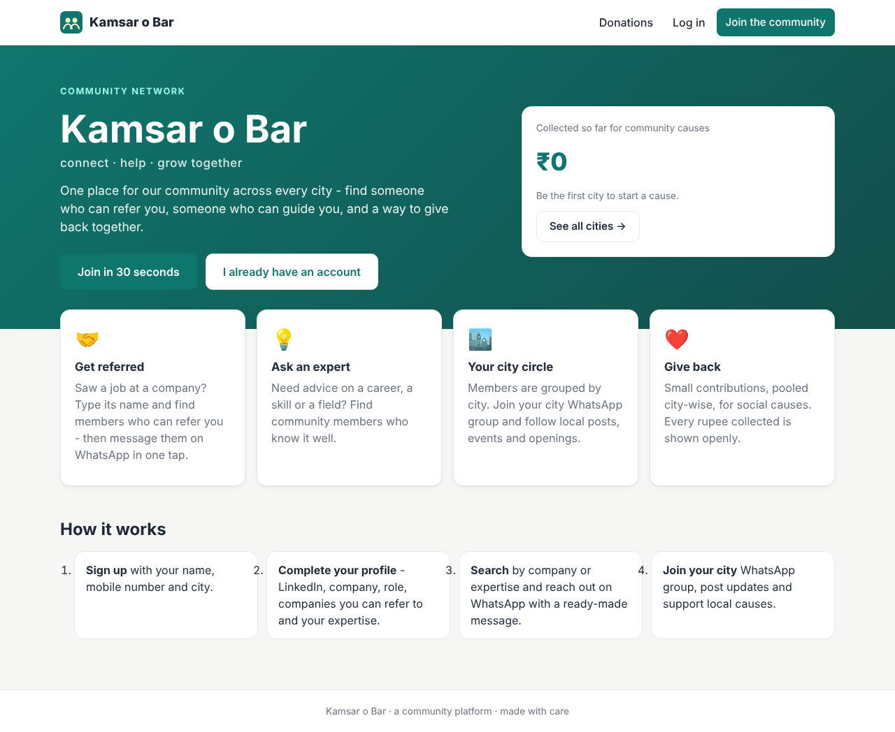

# Kamsar o Bar

A community platform for Kamsar o Bar. Members are grouped by city, and the platform helps them:

- **Get referred.** Saw a job? Type the company name, find members who can refer you, and send them a ready-made WhatsApp message in one tap.
- **Ask an expert.** Search members by expertise (career, technology, exams, business, health...) and message them for advice.
- **Post anything.** Members share text and photos, choosing for each post whether only their own city's members see it or everyone in all cities. Photos are shrunk in the browser to 3 MB or less, without distortion.
- **Seminars and events.** Members post seminars and events, and others tap **Add to my events** to keep them in their *My upcoming events* list (with Google, phone and Outlook calendar export).
- **Join their city circle.** Each city has a WhatsApp group link managed by a city admin.
- **Give back.** Members make small donations to their city's bank or UPI account. Each member sees their own city's total by default, and can pick any other city to see its total.



| Document | What's inside |
|---|---|
| [docs/USER_GUIDE.md](docs/USER_GUIDE.md) | How members, city admins and the main admin use the site, with screenshots |
| [docs/ARCHITECTURE.md](docs/ARCHITECTURE.md) | Code structure, how SOLID principles are applied, and how the app scales |
| [docs/API.md](docs/API.md) | REST API reference |

---

## Tech stack

| Layer | Technology |
|---|---|
| Backend | Java 21, Spring Boot 3.5 (Web, Security with JWT, Data JPA, Validation, Cache, Actuator), Flyway |
| Database | PostgreSQL 16 in production. An embedded H2 database is used for local development, so you don't need to install anything. |
| Frontend | React 19, React Router 7, Vite 8, Axios, plain CSS (responsive and mobile-friendly) |
| Packaging | Docker and Docker Compose. nginx serves the React build and proxies `/api` to the backend. |

---

## Run it on your computer

Pick **one** of the two options below.

### Option A: everything with Docker (easiest)

You only need [Docker Desktop](https://www.docker.com/products/docker-desktop/) installed.

```bash
git clone https://github.com/pycharm0422/kamsarobar.git
cd kamsarobar
docker compose up --build
```

The first build takes a few minutes. Then open **http://localhost:3000**.

- The database and uploaded photos are stored in Docker volumes, so your data survives restarts. `docker compose down -v` wipes them.
- To change the admin login, JWT secret or database password, copy `.env.example` to `.env` and edit it before running `docker compose up`.

### Option B: run backend and frontend directly (for development)

**Prerequisites:** Java 21 (JDK), Maven 3.9+ and Node.js 20.19+ or 22+.

Check what you have:

```bash
java -version    # should print 21.x
mvn -v
node -v
```

**1. Start the backend** (terminal 1):

```bash
cd backend
mvn spring-boot:run
```

This starts the API on **http://localhost:8080** using the `dev` profile. The `dev` profile uses an H2 database stored in a file at `backend/data/` (uploaded photos go to `backend/data/uploads/`), so there's nothing else to install. Flyway creates the tables and seeds a starter list of cities automatically.

**2. Start the frontend** (terminal 2):

```bash
cd frontend
npm install
npm run dev
```

Open **http://localhost:5173**. The Vite dev server forwards `/api` calls to the backend on port 8080.

### First login (main admin)

On first start the backend creates the **main admin** account:

| Mobile | Password |
|---|---|
| `9999999999` | `admin@123` |

Log in with these, then **change the password** right away under *Profile → Password*. You can also set your own values before the first start with the environment variables `ADMIN_NAME`, `ADMIN_MOBILE`, `ADMIN_PASSWORD` and `ADMIN_CITY`.

### Run the backend against PostgreSQL (without Docker)

```bash
# create the database once
createdb kamsarobar   # or: psql -c "CREATE DATABASE kamsarobar"

cd backend
SPRING_PROFILES_ACTIVE=prod \
DB_URL=jdbc:postgresql://localhost:5432/kamsarobar \
DB_USERNAME=postgres DB_PASSWORD=yourpassword \
JWT_SECRET=a-long-random-secret-of-at-least-32-characters \
mvn spring-boot:run
```

On Windows PowerShell, set each variable first (`$env:SPRING_PROFILES_ACTIVE="prod"` and so on), then run `mvn spring-boot:run`.

### Run the tests

```bash
cd backend
mvn test
```

The tests include end-to-end integration tests. One covers registration, both profile forms, referral and expert search, posts and comments, appointing a city admin, city settings and donation verification. Another covers photo upload and validation, photo-only posts, seminars, "add to my events" and per-city donation totals. A third checks that "only my city" posts stay hidden from other cities everywhere: the feed, direct links, comments and events.

```bash
cd frontend
npm run build   # production build into frontend/dist
```

---

## Configuration

All settings are environment variables with safe defaults for local use (see `backend/src/main/resources/application.yml`).

| Variable | Default | Purpose |
|---|---|---|
| `SPRING_PROFILES_ACTIVE` | `dev` | `dev` = embedded H2 database, `prod` = PostgreSQL |
| `DB_URL` / `DB_USERNAME` / `DB_PASSWORD` | `jdbc:postgresql://localhost:5432/kamsarobar` / `kamsarobar` / `kamsarobar` | PostgreSQL connection (prod profile) |
| `DB_POOL_SIZE` | `20` | Database connections per backend instance |
| `JWT_SECRET` | dev-only value | **Must be changed in production.** At least 32 characters. |
| `JWT_EXPIRATION_MINUTES` | `10080` (7 days) | How long a login lasts |
| `ADMIN_NAME` / `ADMIN_MOBILE` / `ADMIN_PASSWORD` / `ADMIN_CITY` | `Main Admin` / `9999999999` / `admin@123` / `Ghazipur` | Main admin created on first start |
| `DEFAULT_COUNTRY_CODE` | `91` | Added to 10-digit mobile numbers (used for WhatsApp links) |
| `CORS_ALLOWED_ORIGINS` | `http://localhost:5173,http://localhost:3000` | Only needed if the frontend is on a different domain than the API |
| `PORT` | `8080` | Backend HTTP port |
| `STORAGE_PATH` | `./data/uploads` | Folder for uploaded photos (a Docker volume in `docker-compose.yml`) |
| `VITE_API_BASE_URL` (frontend, at build time) | `/api` | API location, if not served from the same domain |

---

## Project structure

```
kamsarobar/
├── backend/                     Spring Boot API
│   ├── src/main/java/com/kamsarobar/
│   │   ├── auth/                register / login (form 1)
│   │   ├── user/                user entity, roles, edit basic info
│   │   ├── profile/             professional profile (form 2), companies & skills
│   │   ├── directory/           referral & expert search (pluggable strategies)
│   │   ├── post/                posts (text, photos, seminars/events) & comments
│   │   ├── event/               "my upcoming events" & discover events
│   │   ├── media/               photo upload, storage & cleanup
│   │   ├── donation/            donations, campaigns, city-wise totals
│   │   ├── city/                cities, WhatsApp group & bank details
│   │   ├── admin/               main-admin operations
│   │   ├── access/              authorisation rules (who may do what)
│   │   ├── security/            JWT authentication
│   │   ├── config/              security, cache, bootstrap admin
│   │   └── common/              errors, paging, text/phone utilities
│   └── src/main/resources/db/migration/   Flyway SQL migrations
├── frontend/                    React app
│   └── src/
│       ├── api/                 HTTP client + one small API object per resource
│       ├── context/             authentication state
│       ├── components/          reusable UI (search, member card, WhatsApp composer...)
│       ├── pages/               screens (and pages/admin for the dashboards)
│       └── utils/               WhatsApp / UPI links, formatting, errors
├── docs/                        user guide, architecture, API reference
└── docker-compose.yml
```

## Pushing your own changes to Git

```bash
git checkout -b my-change
git add .
git commit -m "Describe the change"
git push -u origin my-change
```

Then open a pull request on GitHub.
