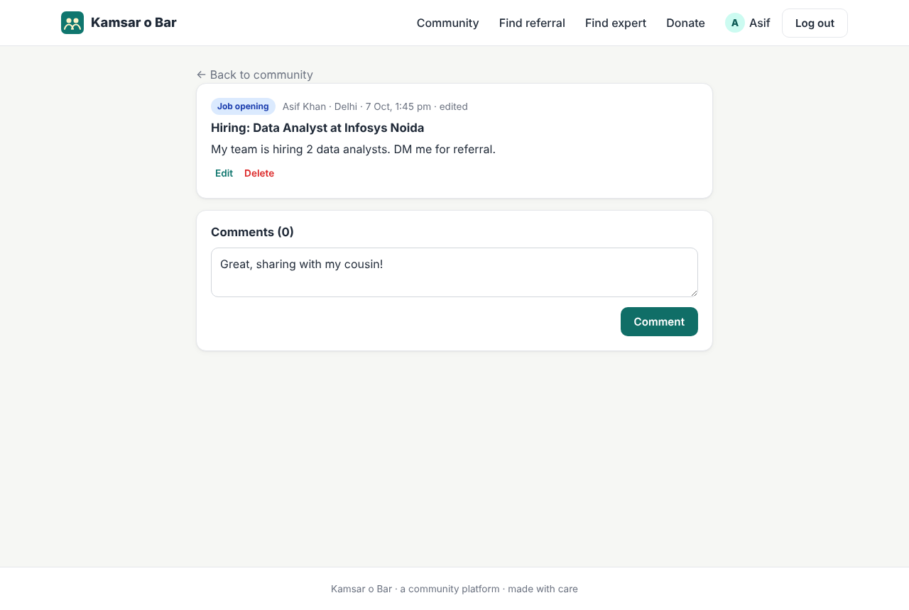
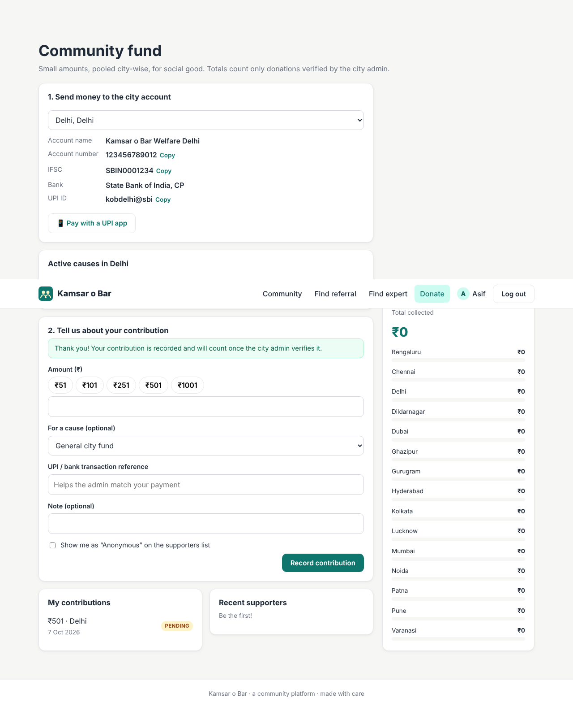

# Kamsar o Bar: User guide

This guide covers the three kinds of users:

1. **Members.** Anyone who joins.
2. **City admins.** The head of a city or area, appointed by the main admin.
3. **The main admin.** Runs the whole platform.

---

## 1. For members

### 1.1 Join (form 1: the basics)

Open the site and click **Join the community**. You only need:

- **Full name**
- **Mobile number.** Use the number you have WhatsApp on. If you type a 10-digit Indian number, +91 is added automatically. If you live abroad, include your country code (for example `+971 50 123 4567`).
- **City you live in.** This puts you in your city's community.
- **A password**, so you can log in later.

### 1.2 Complete your profile (form 2: work and referrals)

Right after joining you see **Step 2 of 2**. Fill this in so other members can find you. You can also click **Skip for now** and come back later from **Profile**.

| Field | Why it matters |
|---|---|
| LinkedIn profile URL | Members can check your background before messaging you |
| Current company, position, experience | Shown on your card in search results |
| **Companies where you can give a referral** | Members searching for these companies will find you. Type a name and press **Enter** after each one. Suggestions appear as you type, so everyone spells company names the same way. |
| **Your expertise** | Members looking for advice on these topics will find you, for example *Java*, *UPSC preparation*, *Real estate* or *Medicine*. |
| Short bio | A line about how you can help |
| *Show me in referral & expert search* | Untick this to hide yourself from search without deleting anything |

**Everything is editable.** Go to **Profile** at any time:

- **Work & referrals** tab: form 2.
- **Basic info** tab: change your name, mobile number or city (for example, if you move to another city).
- **Password** tab: change your password.

### 1.3 Find someone who can refer you

1. Click **Find referral**.
2. Type the **company name** (part of it is enough: "goog" finds *Google* and *Google India*).
3. Optionally choose a **city**, and add the **job role** and **job link**. These go into your message.
4. Click **Search**. You'll see the members who listed that company, with the matching company highlighted.

5. Click **Ask for referral**. A message is written for you, and you can edit it.
6. Click **Open WhatsApp**. WhatsApp opens a chat with that member with your message already typed. On a phone this opens the WhatsApp app. On a computer it opens WhatsApp Web or WhatsApp Desktop.

> Tip: add your LinkedIn URL to your own profile. It's automatically added to the end of your referral requests.

### 1.4 Find an expert for advice

Same as above, but click **Find expert** and search by expertise (for example "design" finds *System Design* and *UI Design*). Click **Ask for advice** to open WhatsApp with a polite request.

### 1.5 Your city community

Click **Community** to see posts from your city.

- **Create a post.** Add a title, pick a category (*General*, *Job opening*, *Help needed*, *Event*, *Announcement*), write it, and click **Post**. You can post in your own city.
- **Read other cities.** Use the city dropdown, or choose *All cities*.
- **Comment.** Open a post to read and add comments.
- **Edit or delete.** Your own posts and comments show **Edit** and **Delete** links.
- **Join the WhatsApp group.** The right-hand panel has a **Join <city> WhatsApp group** button once your city admin adds the link.

### 1.6 Donate

Click **Donate**.

1. **Send money.** Your city's bank account and UPI ID are shown. Use **Copy**, or on a phone tap **Pay with a UPI app** to open GPay, PhonePe or Paytm with the details filled in.
2. **Record your contribution.** Enter the amount (or tap ₹51, ₹101 and so on), optionally pick a cause, and add the **UPI or bank transaction reference** so the admin can match your payment. Tick *Anonymous* if you don't want your name on the supporters list.
3. Your contribution shows as **PENDING** under *My contributions*. Once the city admin checks the bank statement and verifies it, it becomes **VERIFIED** and is added to the city's total.

The panel on the right shows **how much has been collected, city by city**.

> The website never handles money itself. Money goes straight to the city's bank account. The site only records and displays contributions, so totals are transparent.

---

## 2. For city admins (heads of an area)

The main admin appoints you. When that happens, an **Admin** link appears in your menu (log out and back in if you don't see it). You manage **one city**.

### 2.1 Settings: WhatsApp group and bank details

**Admin → Settings**

- **Group invite link.** In WhatsApp, open the group, go to *Group info*, then *Invite via link*, and copy the link (`https://chat.whatsapp.com/...`). Paste it here. Members of your city then see a **Join WhatsApp group** button.
- **Bank details.** Enter the account holder name, bank and branch, account number, IFSC and UPI ID where donations should go. Members of your city see these on the Donate page.

### 2.2 Verify donations

**Admin → Donations** lists contributions recorded for your city. The *Pending* filter is selected first.

1. Compare each entry (amount and transaction reference) with your bank or UPI statement.
2. Click **Verify** if the money arrived, or **Reject** if it didn't.

Only verified donations count towards the totals shown to everyone.

### 2.3 Causes (campaigns)

**Admin → Causes** lets you start a fundraising cause, such as a *Winter blankets drive*, with an optional goal amount. Members can choose the cause when they donate, and a progress bar shows how much has been raised. Click **Close** when the cause is finished.

### 2.4 Moderation

As city admin you can **edit or delete any post or comment in your city**.

---

## 3. For the main admin

Log in with the main admin account (see the README for the first-login details) and open **Admin**.

| Tab | What you can do |
|---|---|
| **Overview** | Number of members, cities, city admins and posts, and the total collected |
| **City admins** | **Appoint a city admin.** Search a member by name or mobile, choose the city they will head, and click **Make city admin**. **Remove** takes the role away. The change applies immediately. |
| **Manage a city** | Do anything a city admin can (settings, donations, causes) for **any** city |
| **Cities** | Add new cities, rename them, or hide a city (hidden cities disappear from the sign-up list) |
| **Members** | Search all members by name or mobile and filter by city |

As main admin you can also moderate posts and comments in every city.

---

## FAQ

**I forgot my password.**
Ask your city admin or the main admin. For now, a password reset by OTP is not built in. See *ARCHITECTURE.md → Extending* for how to add it.

**Why is the WhatsApp button opening the wrong number?**
Check that the member's mobile number includes the right country code. Members can fix their number under *Profile → Basic info*.

**Is my mobile number public?**
No. Only logged-in members can search and see mobile numbers. If you don't want to be contacted, untick *Show me in referral & expert search* in your profile.
