# Kamsar o Bar: User guide

This guide covers the three kinds of users:

1. **Members.** Anyone who joins.
2. **City admins.** The head of a city or area, appointed by the main admin.
3. **The main admin.** Runs the whole platform.

---

## 1. For members

### 1.1 Join (form 1: the basics)

Open the site and click **Join the community**. You only need:

- **Full name**
- **Mobile number.** Use the number you have WhatsApp on. If you type a 10-digit Indian number, +91 is added automatically. If you live abroad, include your country code (for example `+971 50 123 4567`).
- **City you live in.** This puts you in your city's community.
- **A password**, so you can log in later.

### 1.2 Complete your profile (form 2: work and referrals)

Right after joining you see **Step 2 of 2**. Fill this in so other members can find you. You can also click **Skip for now** and come back later from **Profile**.

| Field | Why it matters |
|---|---|
| LinkedIn profile URL | Members can check your background before messaging you |
| Current company, position, experience | Shown on your card in search results |
| **Companies where you can give a referral** | Members searching for these companies will find you. Type a name and press **Enter** after each one. Suggestions appear as you type, so everyone spells company names the same way. |
| **Your expertise** | Members looking for advice on these topics will find you, for example *Java*, *UPSC preparation*, *Real estate* or *Medicine*. |
| Short bio | A line about how you can help |
| *Show me in referral & expert search* | Untick this to hide yourself from search without deleting anything |

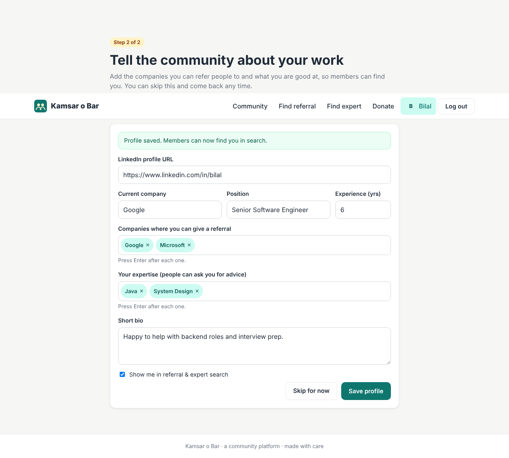

**Everything is editable.** Go to **Profile** at any time:

- **Work & referrals** tab: form 2.
- **Basic info** tab: change your name, mobile number or city (for example, if you move to another city). City admins can't change their own city here; see 2.6.
- **Password** tab: change your password.

### 1.3 Find someone who can refer you

1. Click **Find referral**.
2. Type the **company name** (part of it is enough: "goog" finds *Google* and *Google India*).
3. Optionally choose a **city**, and add the **job role** and **job link**. These go into your message.
4. Click **Search**. You'll see the members who listed that company, with the matching company highlighted.

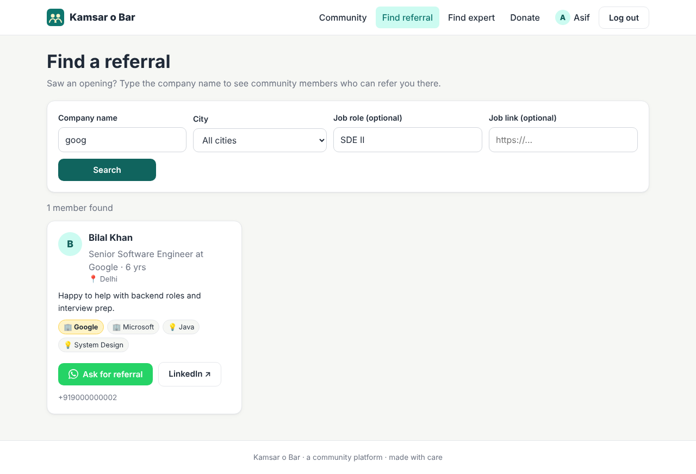

5. Click **Ask for referral**. A message is written for you, and you can edit it.
6. Click **Open WhatsApp**. WhatsApp opens a chat with that member with your message already typed. On a phone this opens the WhatsApp app. On a computer it opens WhatsApp Web or WhatsApp Desktop.

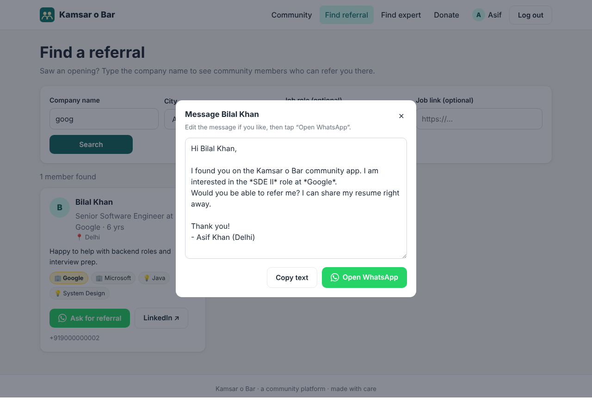

> Tip: add your LinkedIn URL to your own profile. It's automatically added to the end of your referral requests.

### 1.4 Find an expert for advice

Same as above, but click **Find expert** and search by expertise (for example "design" finds *System Design* and *UI Design*). Click **Ask for advice** to open WhatsApp with a polite request.

### 1.5 Posts

Open **Posts** from the menu. You see your own city's posts first. Use the dropdowns to read another city, all cities, or one type of post.

**Post anything.** Text, photos, or both:

1. Optionally choose what you're posting: *General*, *Job opening*, *Help needed*, *Seminar*, *Event* or *Announcement*.
2. Add a title if you like. It's optional for normal posts.
3. Write your text, tap **📷 Add photos** to attach up to 6 photos, or do both.
4. Choose **Who can see this?**:
   - **🏙 Only <your city> members** (the default): only members who live in your city can see it. Use it for local meetups, city news and anything personal to your city.
   - **🌐 Everyone, all cities**: every member of the community can see it.
5. Tap **Post**. Every post shows who can see it next to the date, for example *🏙 Delhi only* or *🌐 Everyone*. You can change it later with **Edit**.

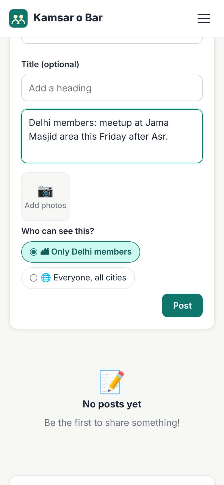

**Posts for all cities show up everywhere.** A post shared with **🌐 Everyone** appears in every city's feed, whichever city is selected, so the whole community sees it.

**Posts from other cities.** Pick another city in the dropdown to see its posts that are shared with everyone, along with posts for all cities. Posts its members kept for their own city don't appear, and their links don't open for people outside that city. The same applies to their comments, and to seminars and events (you can't add another city's city-only event to your list).

A city's admin can see and moderate all posts in the city they manage, and the main admin can see every post. If you move to another city, you still see your own old posts.

**Photos.** You can pick photos straight from your phone's gallery or camera, whatever their size:

- Photos up to 3 MB are uploaded exactly as they are, with no quality loss.
- Bigger photos (a phone camera photo is often 5–12 MB) are shrunk on your phone to under 3 MB before uploading. They keep their exact shape, so nothing is stretched or squashed. Phone photos stay the right way up, and the quality stays high. Uploading is faster too.
- In a post, a single photo is shown whole. Several photos appear as tiles; tap any photo to see it full-screen, uncropped, and swipe through with ‹ ›.

**Comments, editing and deleting.** Tap a post (or its time) to open it, read the comments and add your own. Your own posts and comments show **Edit** and **Delete**.

**Join the WhatsApp group.** Below the posts on a phone (or on the right on a computer), the city card has a **Join <city> WhatsApp group** button once your city admin adds the link.

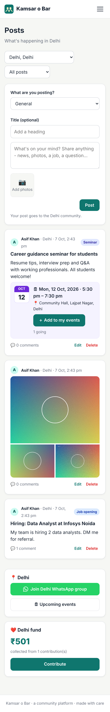

### 1.6 Seminars and events

**Post a seminar or event.** On **Posts**, choose *Seminar* or *Event*. Extra fields appear:

- **Starts** (required) and **Ends** (optional) date and time
- **Venue**, an **Online link** (Zoom, Google Meet...) or both

Add a title and description (and photos, such as a poster), then tap **Post**.

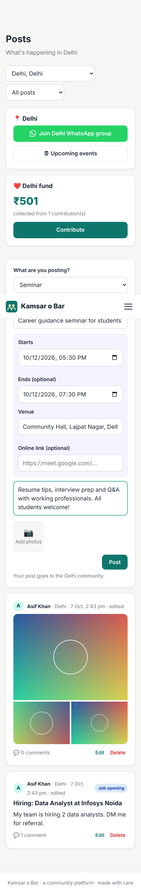

**Add it to your list.** Anyone can tap **＋ Add to my events** on a seminar or event. The button changes to **✓ In my events**, and the event appears under **Events → My upcoming events**, soonest first. Once added, you can also put it in your own calendar with **Google Calendar** or **Phone / Outlook** (downloads a calendar file).

Tap **✓ In my events** again to remove it. Events disappear from the list automatically once they're over.

**Find events.** **Events → Discover** lists upcoming seminars and events in your city, or in any city you pick.

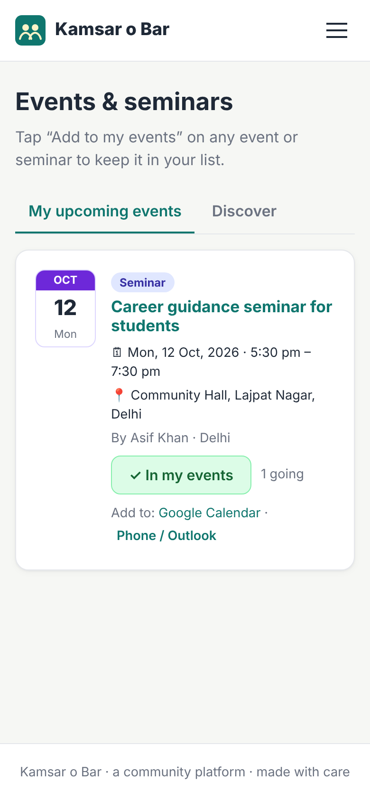

### 1.7 Donate

Click **Donate**. You see **your own city's fund** by default: how much has been collected and from how many contributions. To see another city's fund, pick it under **See another city**; **← Back to <your city>** returns.

1. **Send money.** The selected city's bank account and UPI ID are shown. Use **Copy**, or on a phone tap **Pay with a UPI app** to open GPay, PhonePe or Paytm with the details filled in.
2. **Record your contribution.** Enter the amount (or tap ₹51, ₹101 and so on), optionally pick a cause, and add the **UPI or bank transaction reference** so the admin can match your payment. Tick *Anonymous* if you don't want your name on the supporters list.
3. Your contribution shows as **PENDING** under *My contributions*. Once the city admin checks the bank statement and verifies it, it becomes **VERIFIED** and is added to the city's total.

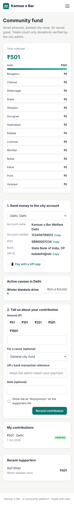

> The website never handles money itself. Money goes straight to the city's bank account. The site only records and displays contributions, so totals are transparent.

---

### 1.8 The mobile app

Everything above is also in the **Kamsar o Bar app** for Android and iPhone. It has five tabs: **Posts**, **Events**, **Find**, **Donate** and **Me**.

The app can also send **notifications**:
- new posts in your city;
- new seminars and events;
- a reminder about an hour before an event you added to *My upcoming events*.

Tap a notification to open the post. Choose what you get under **Me → Notification settings**.

  

---

## 2. For city admins (heads of an area)

The main admin appoints you. When that happens, an **Admin** link appears in your menu (log out and back in if you don't see it). You manage **one city**.

### 2.1 Settings: WhatsApp group and bank details

**Admin → Settings**

- **Group invite link.** In WhatsApp, open the group, go to *Group info*, then *Invite via link*, and copy the link (`https://chat.whatsapp.com/...`). Paste it here. Members of your city then see a **Join WhatsApp group** button.
- **Bank details.** Enter the account holder name, bank and branch, account number, IFSC and UPI ID where donations should go. Members of your city see these on the Donate page.

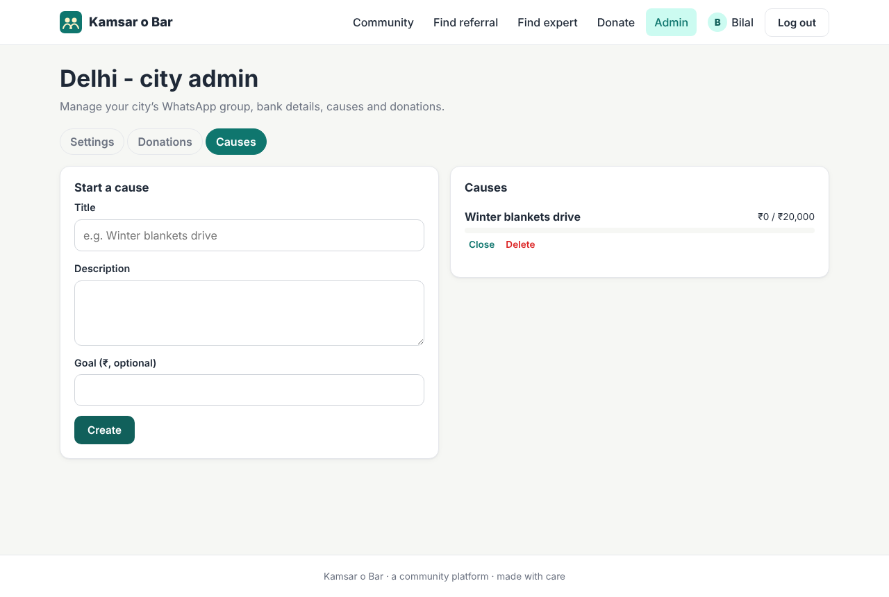

### 2.2 Verify donations

**Admin → Donations** lists contributions recorded for your city. The *Pending* filter is selected first.

1. Compare each entry (amount and transaction reference) with your bank or UPI statement.
2. Click **Verify** if the money arrived, or **Reject** if it didn't.

Only verified donations count towards the totals shown to everyone.

### 2.3 Causes (campaigns)

**Admin → Causes** lets you start a fundraising cause, such as a *Winter blankets drive*, with an optional goal amount. Members can choose the cause when they donate, and a progress bar shows how much has been raised. Click **Close** when the cause is finished.

### 2.4 Members of your city

**Admin → Members** lists everyone living in your city. You can search by name or mobile, and filter by *Active* or *Blocked*. Tap a name to open the member's page:

- **Basic details** with **WhatsApp** and **Call** buttons.
- **Work profile:** position and company, experience, LinkedIn, bio, the companies they can refer to, and their expertise.
- **Activity:** posts, comments, events added, donations, and the verified amount donated.

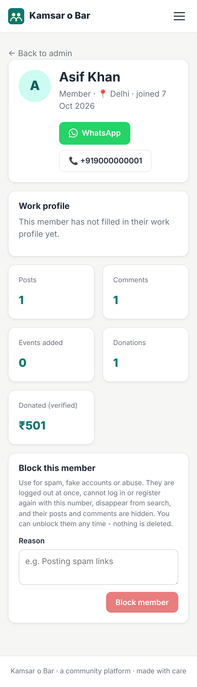

**Blocking.** Use it for spam, fake accounts or abuse. On the member's page, write a reason and tap **Block member**. The member:

- is **logged out immediately** and can't log in or register again with the same number. They see *"Your account has been blocked. Please contact your city admin."*
- disappears from referral and expert search;
- has all their posts and comments hidden from everyone.

**Nothing is deleted.** Tap **Unblock** on their page and everything comes back. The page shows the reason, when they were blocked, and by whom.

City admins can block ordinary members of their own city. Other admins can be blocked only by the main admin, and nobody can block the main admin or themselves.

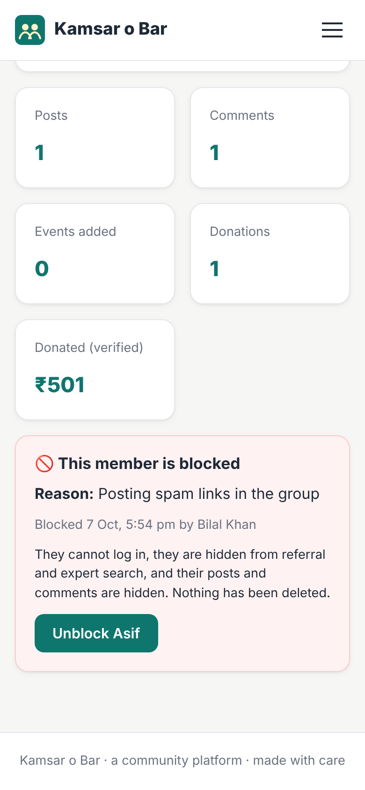 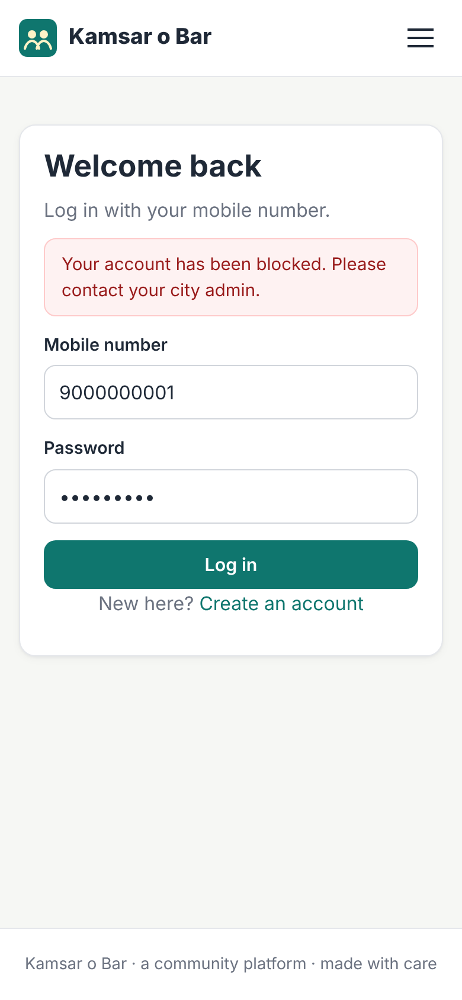

### 2.5 Moderation

As city admin you can **edit or delete any post, photo or comment in your city**.

### 2.6 Your own city is locked

You are the head of one city, so you **can't change your own city** under *Profile → Basic info*. The city field is greyed out. You can still change your name, mobile number and password. If you move, ask the main admin to move you (see 3.1).

---

## 3. For the main admin

Log in with the main admin account (see the README for the first-login details) and open **Admin**.

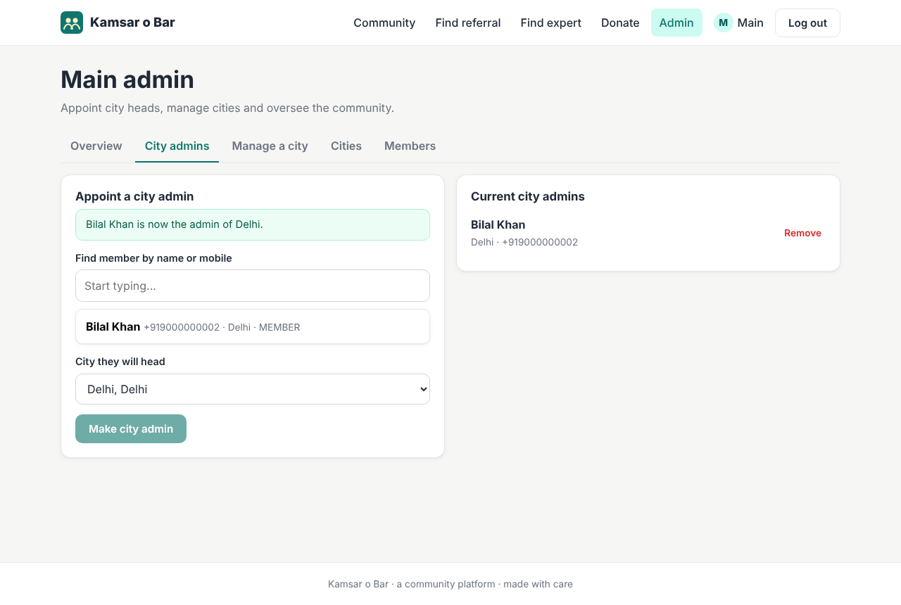

| Tab | What you can do |
|---|---|
| **Overview** | Number of members, cities, city admins and posts, and the total collected |
| **City admins** | **Appoint a city admin.** Search a member by name or mobile, choose the city they will head, and click **Make city admin**. **Remove** takes the role away. The change applies immediately. Each city has one admin; see 3.1. |
| **Manage a city** | Do anything a city admin can (settings, donations, causes) for **any** city |
| **Cities** | Add new cities, rename them, or hide a city (hidden cities disappear from the sign-up list) |
| **Members** | Every member in every city. Search by name or mobile, and filter by city and by *Active* or *Blocked*. Tap a name for the full profile and activity, and to **block or unblock** anyone, including city admins (see 2.4). |

As main admin you can also moderate posts and comments in every city.

### 3.1 Moving members and city admins

Only the main admin can change a city admin's city. Open **Members**, tap the person, and use the **City** card: pick the new city under *Lives in* and tap **Move**. You can move ordinary members the same way.

**One admin per city.** Each city has exactly one admin.

| What you do | What happens |
|---|---|
| Move an **ordinary member** | Only the city they live in changes. |
| Move a **city admin** to a city with **no admin** | They live in the new city **and become its admin**. Their old city is left **without an admin**, so appoint a new one there. |
| Move a city admin (or appoint anyone) to a city that **already has an admin** | You're asked: *"Delhi already has an admin: Bilal Khan. Make Imran Khan the admin instead? The current admin will become a regular member."* **OK** makes the new person the admin, and the previous admin becomes an ordinary member (they keep their account, posts and city). **Cancel** changes nothing. |

---

## FAQ

**I forgot my password.**
Ask your city admin or the main admin. For now, a password reset by OTP is not built in. See *ARCHITECTURE.md → Extending* for how to add it.

**Why is the WhatsApp button opening the wrong number?**
Check that the member's mobile number includes the right country code. Members can fix their number under *Profile → Basic info*.

**Is my mobile number public?**
No. Only logged-in members can search and see mobile numbers. If you don't want to be contacted, untick *Show me in referral & expert search* in your profile.
